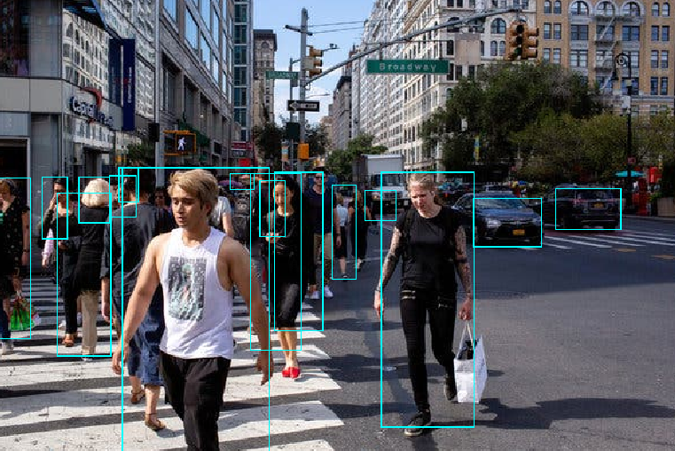

# Tensorflow-SSD-Object-Detection
Object Location using pretrained Single Shot Detection technique and Tensorflow.

Download the frozen graph file from here or from the official repo in:
https://github.com/tensorflow/models/blob/master/research/object_detection/g3doc/detection_model_zoo.md

The program passes an image to the premade tensorflow graph and reads and unparses the output into openCV ROIs boxes.
Will try to implement this on video to check the real speed of the Single Shot Detection.

In the test image the cars, people and purses are detected.
 
